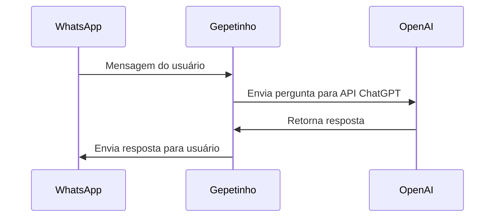

# 🤖 Gepetinho - ChatGPT no WhatsApp 

[](https://kotlinlang.org)
[](https://spring.io/projects/spring-boot)

Integração do ChatGPT com WhatsApp utilizando a API do Facebook Business e OpenAI.

## 📖 Histórico

O Gepetinho surgiu antes do lançamento oficial do app da OpenAI com o objetivo de integrar o ChatGPT ao WhatsApp, permitindo:

- Tirar dúvidas rápidas diretamente pelo WhatsApp
- Criar rotinas automatizadas via mensagens
- Acessar o ChatGPT de forma conveniente no app de mensagens

### Versões

- **gepetinho-v1**: Versão inicial em Java usando RestTemplate
- **gepetinho-v2**: Versão atual em Kotlin mais moderna usando Feign Client 🚀

### 📌 Endpoints da API

| Método  | Endpoint   | Descrição                              |
|---------|------------|----------------------------------------|
| GET     | /webhook   | Health check e verificação do webhook  |
| POST    | /webhook   | Recebe mensagens enviadas via WhatsApp |

## ⚙️ Funcionamento


 - Webhook do Facebook recebe mensagens do WhatsApp

 - Endpoint POST /webhook processa a mensagem

 - Mensagem é enviada para API da OpenAI (/chat/completions)

 - Resposta é enviada de volta via API do WhatsApp Business

## 🛠 Tecnologias
- Linguagem: Kotlin 💙

- Framework: Spring Boot ☕

- HTTP Client: Feign Client 🌐

## APIs:

- WhatsApp Business (Facebook) 📞

- OpenAI ChatGPT API 🧠

## 🚀 Como Executar
- Pré-requisitos
- Java 17+
- Conta no Facebook Developers
- Número de WhatsApp Business vinculado
- Token de acesso da OpenAI

## Configuração
Clone o repositório:
```bash
git clone https://github.com/seu-usuario/gepetinho-v2.git
cd gepetinho-v2
```
Configure o application.properties:
```properties
#config gpt
gpt.message.model=gpt-3.5-turbo
gpt.message.role=user
gpt.mesage.request.url=https://api.openai.com/v1/chat/completions
gpt.token={token}


#config whats
whats.message.number=119999999999
whats.message.url=https://graph.facebook.com/v16.0/{message.number}/messages
whats.token ={token-api-messages}
whats.verification.token={token-webhook}
```
Exponha localmente (usando ngrok):
```bash
ngrok http 8080
```
## Exemplo de uso das APIs integradas
###  Request - OpenAi completions 
```http
POST https://api.openai.com/v1/chat/completions
Authorization: Bearer seu_token
Content-Type: application/json

{
  "model": "gpt-3.5-turbo",
  "messages": [
    {"role": "user", "content": "Olá!"}
  ]
}
```
### Response
```json
{
  "id": "chatcmpl-123",
  "object": "chat.completion",
  "created": 1677652288,
  "choices": [{
    "index": 0,
    "message": {
      "role": "assistant",
      "content": "Olá! Como posso te ajudar hoje?"
    }
  }]
}
```
###   Request  - WhatsApp messages
```http
POST /v16.0/{phone-number-id}/messages
Host: graph.facebook.com
Authorization: Bearer seu_token_whatsapp
Content-Type: application/json

{
  "messaging_product": "whatsapp",
  "recipient_type": "individual",
  "to": "5511999999999",
  "type": "text",
  "text": {
    "body": "Olá! Esta é uma mensagem de teste do Gepetinho!"
  }
}
```

### Response
```json
{
  "messaging_product": "whatsapp",
  "contacts": [{
    "input": "5511999999999",
    "wa_id": "5511999999999"
  }],
  "messages": [{
    "id": "wamid.ABGSKjdslkjfslkfjlsdkjflskdjflsdkjf"
  }]
}
```
